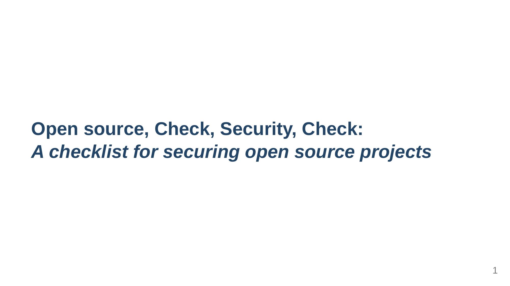

# Open source, check, security, check

## Description

This repository contains the [Marp](https://marpit.marp.app/) project and export for the talk "*Open source, check, security, check: A checklist for securing open source projects*".

## Abstract

> Open source software powers much of the technology we use today, from Linux and Kubernetes to Git. However, open source projects often face resource constraints. Contributors typically have limited time and budget to invest, which can lead to a focus only on user-facing features. This can sometimes come at the expense of important but less flashy tasks like security best practices, automated builds, and unit testing.
> 
> Our talk, "Open Source Security: Simple Steps for Big Impact," addresses the first challenge. We'll present a clear and actionable checklist that open source maintainers can use to improve the security of their projects, even with limited resources.

## Preview

<a href="export.pdf">
    <kbd>
        
    </kbd>
</a>

## Showcases

| Event                                                                                          | Showcase date | Showcase locatiom                                  | Duration   | References                                                            |
| ---------------------------------------------------------------------------------------------- | ------------- | -------------------------------------------------- | ---------- | --------------------------------------------------------------------- |
| [Ubuntu Meetup/Workshop in Africa](https://twitter.com/ubuntu_Africa__)                        | November 2023 | Virtual, but event happening physically in Nigeria | 15 minutes |                                                                       |
| [Opportunity Open Source Conference](https://events.canonical.com/event/89/contributions/476/) | August 2024   | Virtual, but event happening physically in India   | 20 minutes | [Talk page](https://events.canonical.com/event/89/contributions/477/) |
