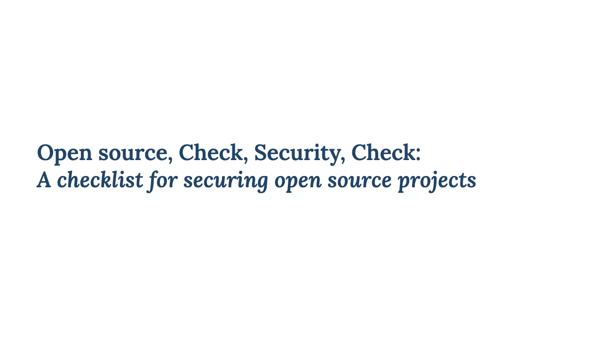

# Open source, check, security, check

## Description

This repository contains the [Marp](https://marpit.marp.app/) project and export for the talk "*Open source, check, security, check: A checklist for securing open source projects*".

## Preview

<a href="export.pdf">
    <kbd>
        
    </kbd>
</a>

## Showcases

| Event                                                                                          | Showcase date | Showcase locatiom                                  | Duration   | References                                                            |
| ---------------------------------------------------------------------------------------------- | ------------- | -------------------------------------------------- | ---------- | --------------------------------------------------------------------- |
| [Ubuntu Meetup/Workshop in Africa](https://twitter.com/ubuntu_Africa__)                        | November 2023 | Virtual, but event happening physically in Nigeria | 15 minutes |                                                                       |
| [Opportunity Open Source Conference](https://events.canonical.com/event/89/contributions/476/) | August 2024   | Virtual, but event happening physically in India   | 20 minutes | [Talk page](https://events.canonical.com/event/89/contributions/477/) |
