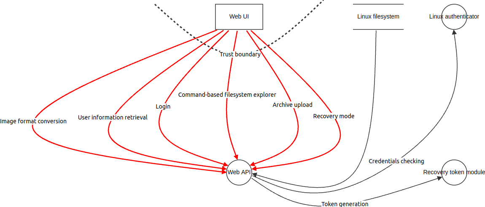
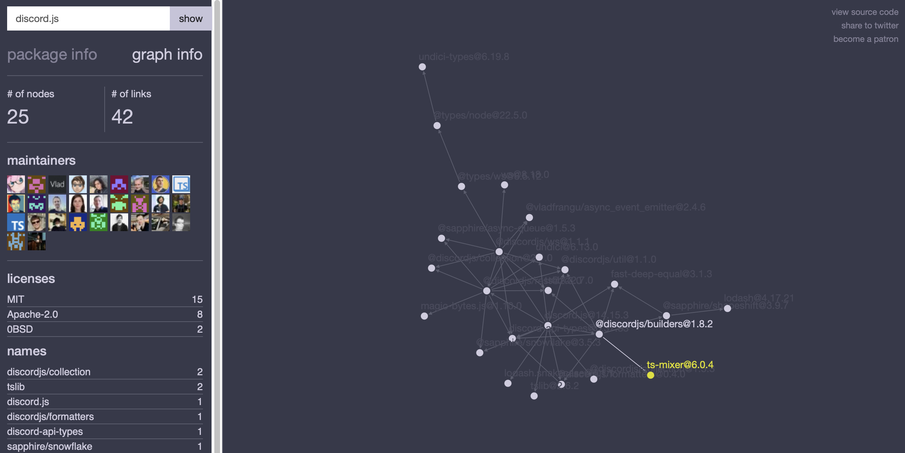
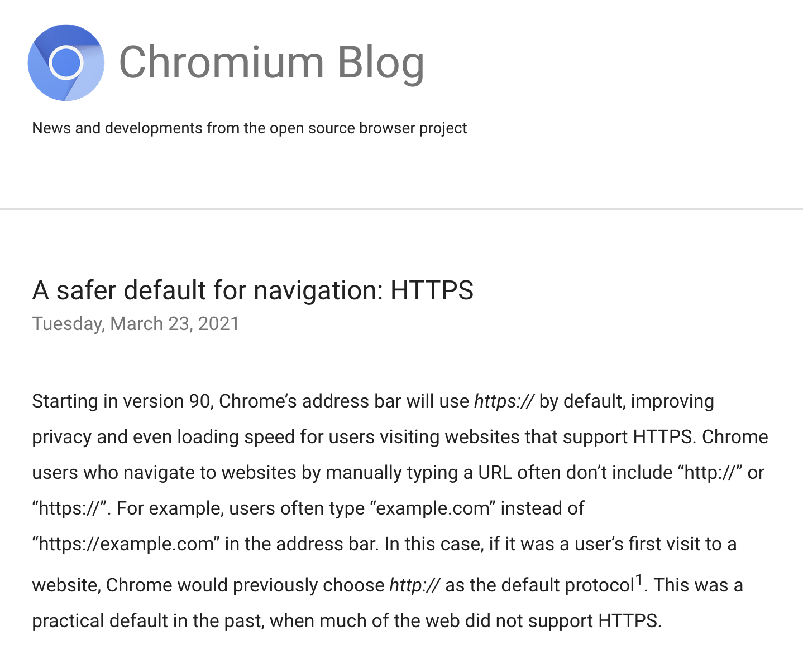
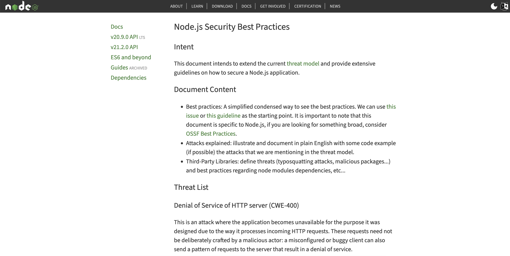
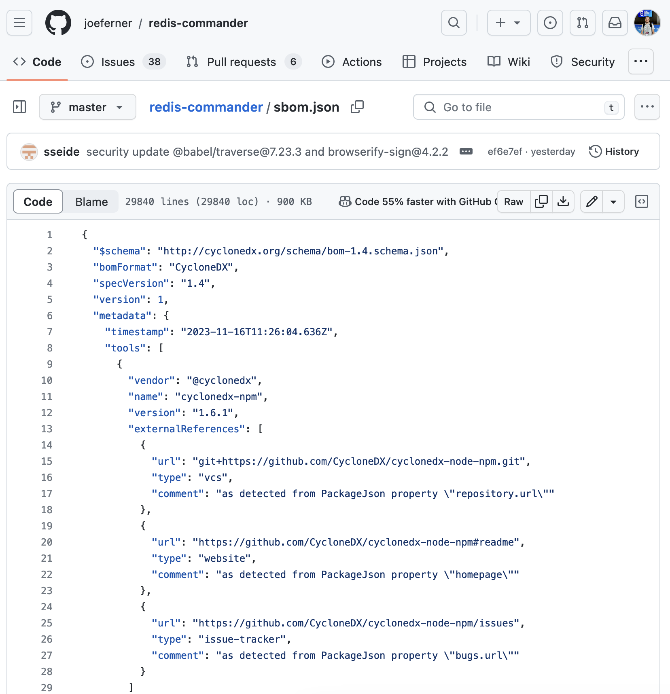
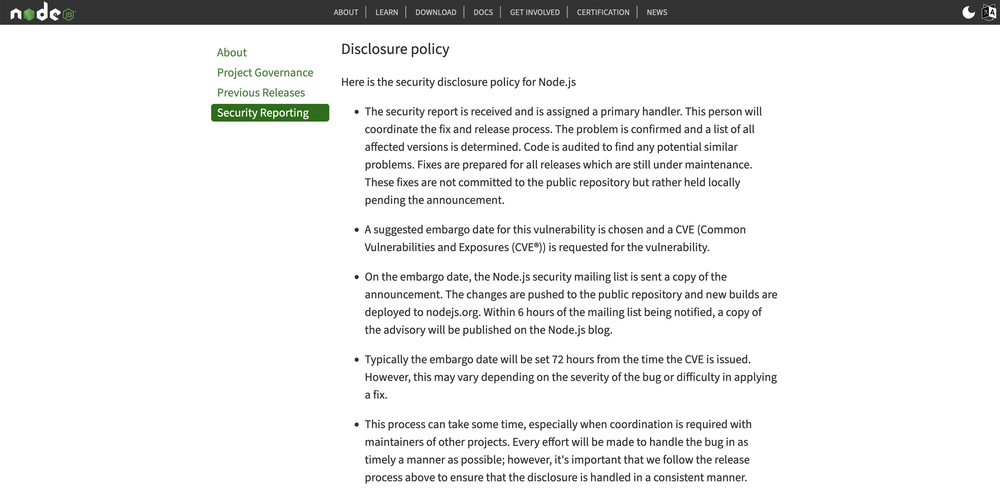
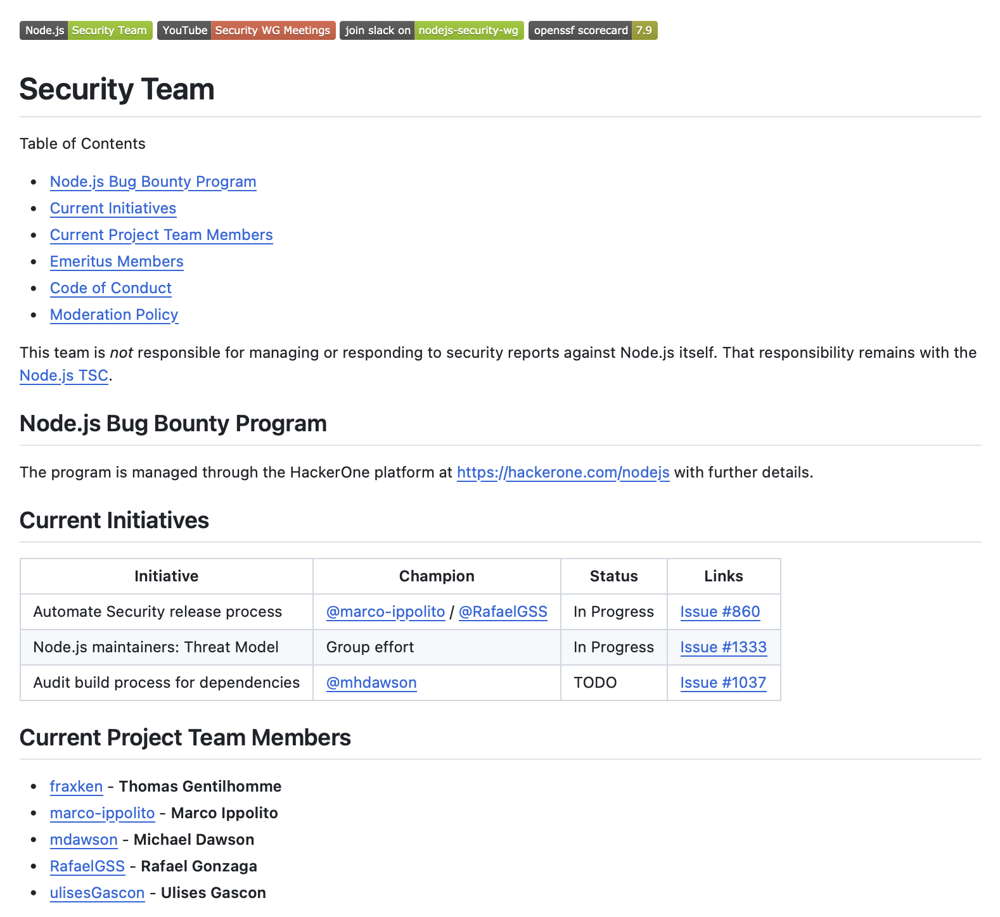
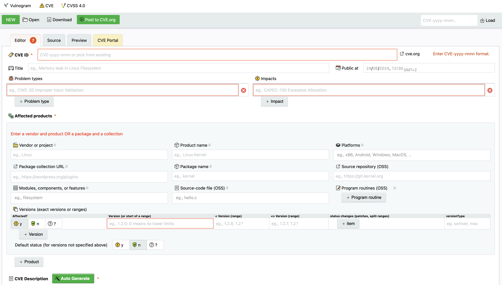

<!-- _class: lead -->

# Open source, Check, Security, Check: <i>A checklist for securing open source projects</i>

---

## @iosifache

* Ex-builder at MutableSecurity
* Ex-security engineer @ Romanian Army and Canonical
* Security engineer in Snap Inc.
* Open source maintainer
* GSoC mentor for OpenPrinting
* Enthusiast of good coffee, long runs/hikes, and quality time

---

---

### YES,

* Large scale use in:
  - Profitable companies
  - Critical infrastructures
* Permissive licences
* Publicly reviewable code

### BUT

* Unpaid maintainers
* Unmaintained, vulnerable projects
* Lack of ethical security testing 
* Low-hanging fruits for threat actors

---

---

## ~~Notations~~ Emoji time!

* ☑️ for (wanna-be) one-time activities
* 🔁 for recurrent activities
* 📦 for closed source friendly activities

---

<!-- _class: lead -->

### I. Proactively find vulnerabilities

---

<!-- _class: lead -->

### 1. Create and maintain a threat model ☑️🔁📦

---

---

<!-- _class: lead -->

### 2. Check for vulnerabilities in your dependencies ☑️🔁

---

---

<!-- _class: lead -->

### 3. Run security tools and constantly validate the warnings ☑️🔁📦

---

1) Run multiple tools
2) Aggregate the results (e.g., with the [SARIF](https://sarifweb.azurewebsites.net/) format)
3) Review the results
4) Suppress the false positives
5) Create automation for development environments and CI workflows

---

<!-- _class: lead -->

### 4. Integrate your project in OSS-Fuzz ☑️🔁

---

---

<!-- _class: lead -->

### II. Secure your users

---

<!-- _class: lead -->

### 1. Design your software to be secure by default ☑️🔁📦

---

---

<!-- _class: lead -->

### 2. Have security recommendations for users ☑️🔁📦

---

---

<!-- _class: lead -->

### 3. Create SBOMs ☑️📦

---

---

<!-- _class: lead -->

### III. Establish a security reporting process

---

<!-- _class: lead -->

### 1. Have a standardised, documented process for responding to vulnerabilities ☑️📦

---

---

<!-- _class: lead -->

### 2. Create a security policy ☑️📦

---

---

<!-- _class: lead -->

### 3. Find backup security responders ☑️📦

---

---

<!-- _class: lead -->

### 4. Be transparent and verbose with the reported vulnerabilities 🔁📦

---

---

---

### The Open Source Fortress

* Workshop for finding software vulnerabilities using open source tools
* Vulnerable-by-default Python and C web application
* Tasks (and solutions) for linting, code querying, secret scanning, dependency scanning, fuzzing, and symbolic execution
* [`iosifache/oss_fortress` as a GitHub repository](https://github.com/iosifache/oss_fortress)
* [`ossfortress.io` as a wiki](https://ossfortress.io/)

---

---

<h1>Say hi!</h1>

