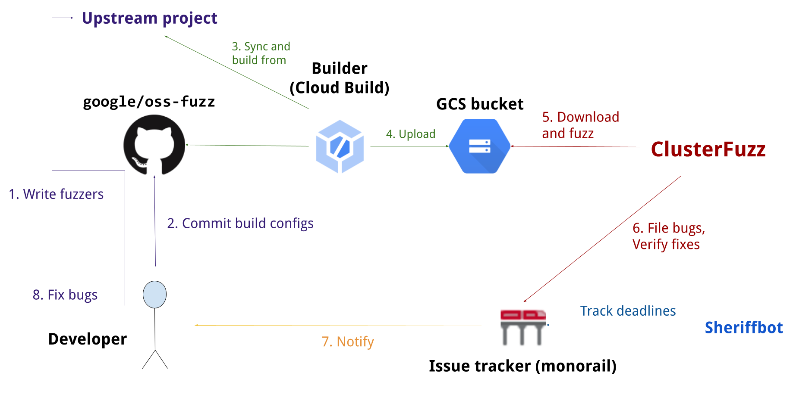
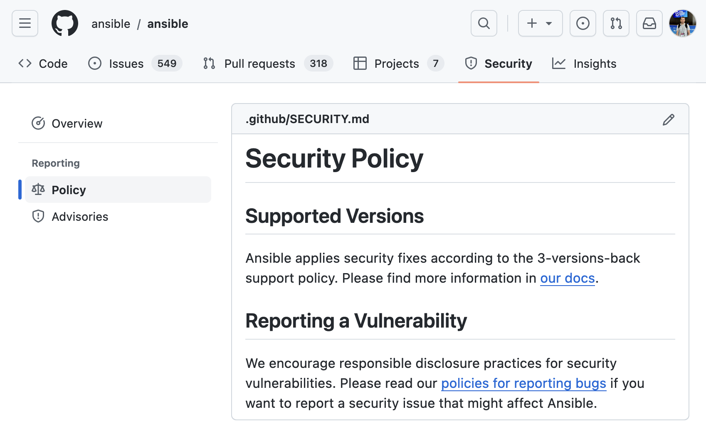

<!-- _class: lead -->

# Open source, Check, Security, Check: <i>A checklist for securing open source projects</i>

---

---

---

---

---

---

---

### YES,

- Large scale use in:
  - Profitable companies
  - Critical infrastructures
- Permissive licences
- Publicly reviewable code

### BUT

- Unpaid maintainers
- Unmaintained, vulnerable projects
- Lack of ethical security testing 
- Low-hanging fruits for threat actors

---

---

## ~~Notations~~ Emoji time!

☑️ for (wanna-be) one-time activities
🔁 for recurrent activities
📦 for closed source friendly activities

---

<!-- _class: lead -->

### I. Proactively find vulnerabilities

---

<!-- _class: lead -->

### 1. Create and maintain a threat model ☑️🔁📦

---

---

<!-- _class: lead -->

### 2. Check for vulnerabilities in your dependencies ☑️🔁

---

---

<!-- _class: lead -->

### 3. Run security tools and constantly validate the warnings ☑️🔁📦

---

1. Run multiple tools
2. Aggregate the results (e.g., with the [SARIF](https://sarifweb.azurewebsites.net/) format)
3. Review the results
4. Suppress the false positives
5. Create automation for development environments and CI workflows

---

<!-- _class: lead -->

### 4. Integrate your project in OSS-Fuzz ☑️🔁

---

---

<!-- _class: lead -->

### II. Secure your users

---

<!-- _class: lead -->

### 1. Design your software to be secure by default ☑️🔁📦

---

---

<!-- _class: lead -->

### 2. Have security recommendations for users ☑️🔁📦

---

---

<!-- _class: lead -->

### 3. Create SBOMs ☑️📦

---

---

<!-- _class: lead -->

### III. Establish a security reporting process

---

<!-- _class: lead -->

### 1. Have a standardised, documented process for responding to vulnerabilities ☑️📦

---

---

<!-- _class: lead -->

### 2. Create a security policy ☑️📦

---

---

<!-- _class: lead -->

### 3. Find backup security responders ☑️📦

---

---

<!-- _class: lead -->

### 4. Be transparent and verbose with the reported vulnerabilities 🔁📦

---

---

---

### The OSS Fortress

- Workshop for finding software vulnerabilities using open source tools
- Vulnerable-by-default Python and C web application
- Tasks (and solutions) for linting, code querying, secret scanning, dependency scanning, fuzzing, and symbolic execution
- [`iosifache/oss_fortress` on GitHub](https://github.com/iosifache/oss_fortress)
- [`ossfortress.io` as a wiki](https://ossfortress.io/)

---

---

# `ping @iosifache`

- Website: [iosifache.me](https://iosifache.me)
- GitHub: [@iosifache](https://github.com/iosifache)
- X: [@iosifache](https://x.com/iosifache)
- LinkedIn: [@iosifache](https://www.linkedin.com/in/iosifache/)
